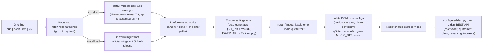
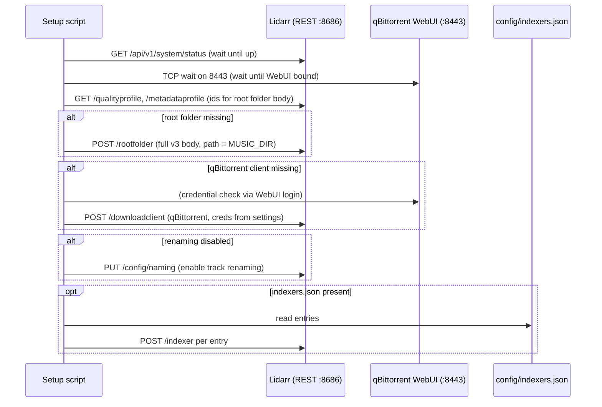

# Architecture

This document describes how music-stack is put together: the single contract between the
services, the platform-parity rule that keeps three install scripts from drifting apart, and
how configuration flows from one `settings.env` into three self-hosted services. For "what to
run and in what order," see `README.md` — this document is the map of *why* it's structured
this way.

The diagrams below are also kept as standalone Mermaid source files in
[`docs/diagrams/`](docs/diagrams) so they can be rendered outside GitHub (mermaid CLI,
mermaid.live, etc.) without copy-pasting out of this file.

## 1. The only contract: the filesystem

The stack is three services that never talk to each other directly. Navidrome does not know
Lidarr exists; Lidarr does not know Navidrome exists. The single thing that connects them is a
shared directory, `MUSIC_DIR`:

- **Lidarr's root folder** *is* `MUSIC_DIR` — it writes downloaded, tagged, renamed albums
  into it.
- **Navidrome's MusicFolder** *is* `MUSIC_DIR` — it scans and streams exactly that directory.

Nothing else is shared. That one path is the entire integration surface, which is deliberate:
each service is configured independently, can be upgraded or replaced independently, and the
"integration" can be broken and repaired by pointing both at the same folder again.

```mermaid
flowchart TB
    subgraph Grab["Acquisition side"]
        Lidarr["Lidarr — artist monitor +\nmatch against what you own"]
        Qbit["qBittorrent — torrent client\n(only consumer of Lidarr's downloads)"]
    end
    subgraph Library["The shared contract"]
        MusicDir["MUSIC_DIR\n(Lidarr root folder == Navidrome MusicFolder)"]
    end
    subgraph Stream["Listening side"]
        Navidrome["Navidrome — scanner + streamer"]
        Clients["Browser / Symfonium /\nDSub / iOS Music / ..."]
    end

    Lidarr -->|"grabs missing albums via the\nqBittorrent WebUI API (host, port, creds)"| Qbit
    Qbit -->|"tags + renames into"| MusicDir
    MusicDir -->|"file watcher + scan schedule"| Navidrome
    Navidrome -->|"Subsonic API"| Clients

    style MusicDir fill:#0a0a0a,stroke-dasharray: 5 5
```

Because the contract is the filesystem, the two services never need each other to be up: Lidarr
can keep completing the library while Navidrome is stopped, and Navidrome serves what already
exists even if Lidarr is down.

## 2. Three platforms, one behavior

Three setup scripts (`scripts/windows/`, `scripts/macos/`, `scripts/raspberry-pi/`) install the
same stack natively — no Docker, no shared runtime. The scripts are **behaviorally identical**
about everything the user observes: same ports, same `settings.env` semantics, same generated
configs, same idempotency, same post-configuration over the Lidarr REST API. What legitimately
varies is only the platform-native plumbing:

| Concern | Windows | macOS (Intel) | Raspberry Pi |
| --- | --- | --- | --- |
| Package manager (bootstrapped if missing) | winget | Homebrew + Xcode CLT | apt |
| App installs | installers via winget / official downloads | Homebrew formulas + tarballs | apt + tarballs |
| Auto-start | NSSM services | LaunchAgents | systemd units |
| qBittorrent form | GUI (`qbittorrent.exe`) | Homebrew GUI app | `qbittorrent-nox` headless |
| Config dir | `%APPDATA%\qBittorrent\` | `~/Library/Preferences/` | `~/.config/qBittorrent/` |
| Lidarr root | `C:\ProgramData\Lidarr\` | Homebrew | `/opt/Lidarr/` |
| Settings fallback `MUSIC_DIR` | `C:\Music` | `~/Music` | `/mnt/music` |
| Settings fallback `DATA_DIR` | `C:\ProgramData\music-stack` | `~/Library/Application Support/music-stack` | `/var/lib/music-stack` |

The parity rule is the maintenance contract: **a change to one script almost always needs the
mirrored change in the other two.** The shared helpers live in `scripts/common/lib.sh`
(macOS + Pi) and the shared post-configuration logic in `scripts/common/configure-lidarr.py`
(all three) precisely so that the platform scripts contain as little divergent logic as
possible. See `MAINTENANCE.md` for the places the three copies still have to be touched in
lockstep.

## 3. The one-liner bootstrap chain

Every install is one shell command that assumes nothing about the machine except that a shell
exists. The bootstrap (`scripts/install.sh` for macOS/Pi, `scripts/windows/install.ps1` for
Windows) fetches the repo as a tarball/zip — **git is never required** — then hands off to the
platform setup script, which bootstraps the missing package manager and then does the real
work.

The chain is deliberately **not** "install everything, then configure": the setup script writes
configs, registers services, waits for Lidarr to boot, and only then configures it over its
REST API. Configuration over the API (rather than writing Lidarr's database directly) means the
post-config is version-independent and re-runnable, which is what makes every script idempotent
— re-running the one-liner is safe and reconciles an existing install.

## 4. Configuration generation

One file — `settings.env` (`.example` shipped; created with random secrets on first run) — is
the single source of truth. Every script reads it through the same helpers
(`ms_ensure_settings` / `ms_setting` in `lib.sh`, the equivalent in
`Setup-MusicStack.ps1`) and falls back to the per-platform defaults in §2 for anything empty.

Three properties of the generated configs are load-bearing and easy to get wrong:

- **Everything is written BOM-less.** Windows PowerShell's `Set-Content -Encoding UTF8` emits a
  UTF-8 BOM (`EF BB BF`), which is fine for PowerShell consumers but fatal for the TOML parser
  Navidrome uses — a single BOM byte is why Navidrome died with a parse error on the first real
  install. The Windows script routes every config write through `Write-Utf8NoBom`
  (`[IO.File]::WriteAllText` with `UTF8Encoding($false)`); the bash scripts write with heredocs,
  which never emit a BOM.
- **Secrets are generated, not shipped.** An empty `QBIT_PASSWORD` / `LIDARR_API_KEY` becomes a
  random value at install time (printed once). Lidarr's API key must be **at least 20
  characters** in v3, so the generator produces 32 hex characters. The qBittorrent WebUI
  password is written into qBittorrent's config in the format that version accepts — see §5.
- **qBittorrent's config file is version- and platform-sensitive.** v5.2 renamed the Windows
  config from `qBittorrent.conf` to `qBittorrent.ini` (Linux/macOS still use `.conf`), and v5.x
  reads **only** the PBKDF2-hashed `WebUI\Password_PBKDF2`, ignoring the pre-v5 MD5
  `WebUI\Password`. The scripts write *both* keys (MD5 for ≤5.1, PBKDF2 for ≥5.0) to both files
  on Windows so the same pre-seed works across versions, and launch qBittorrent with
  `--confirm-legal-notice` so the first-run Legal Notice dialog cannot block startup before the
  WebUI binds. The PBKDF2 value is `base64(16 random bytes):base64(PBKDF2-HMAC-SHA512(password,
  salt, 100000, 64))`, reproduced by `Rfc2898DeriveBytes` in PowerShell and the
  `ms_qbit_pbkdf2` helper (python3 `hashlib.pbkdf2_hmac`) in bash — see `MAINTENANCE.md` if you
  ever touch it.

## 5. Post-configuration over REST

`scripts/common/configure-lidarr.py` is the only component that speaks to a service's API. It
is Python 3 stdlib only (no pip dependencies), idempotent, and applies the user's settings:

1. waits for Lidarr's API and the qBittorrent WebUI port to come up (bounded waits, not sleeps);
2. creates Lidarr's root folder = `MUSIC_DIR` — a full v3 `RootFolderResource` body (quality +
   metadata profile ids, monitor options), because a bare `{path}` is rejected with HTTP 400;
3. registers qBittorrent as the download client (host, port, credentials from settings);
4. enables track renaming (`{Artist Name} - {Album Title} - {track:00} - {Track Title}`);
5. adds indexers from `config/indexers.json` if present (optional; schema documented in the
   example file).

Everything is read-modify-write against the live service: root folder and download client are
only created if missing, renaming is only toggled if off. That makes the post-config safe to
re-run after a service restart or a re-run of the setup script, and it means Lidarr's own
database stays authoritative — the script never edits it directly.

The two bounded waits matter: both Lidarr and qBittorrent take longer than a naive `sleep` to be
ready on first boot, and a post-config that fires too early is the classic "everything worked,
then the client silently vanished" failure mode.

## 6. Idempotency and safety conventions

- **Everything is re-runnable.** Re-running a one-liner or setup script reconciles an existing
  install: installed tools are skipped, configs are regenerated only when the target file is
  absent or missing a required key, services are re-registered idempotently.
- **`MUSIC_DIR` writability is granted, not assumed.** Lidarr validates its root folder by
  probing it *as the service account*. On Windows the service runs as the local machine account,
  and granting that account by name fails on workgroup machines (`No mapping between account
  names and security IDs`), so the script grants the equivalent of Everyone modify on `MUSIC_DIR`
  and the download dir instead.
- **The post-config owns its own retry logic** (bounded waits), so the setup scripts don't need
  sleep-and-pray sequencing.

## 7. Known gaps (manual by design)

- **Navidrome's first admin account** has no env-var; the web UI requires it on first visit.
- **Indexers.** Lidarr can only discover releases via indexers, and music quality on public
  trackers is poor. `config/indexers.json` automates registration once you supply credentials,
  but a private music tracker / usenet indexer is what makes the "complete my library" workflow
  real.
- **Lidarr's metadata server** is degraded by upstream issue
  [Lidarr#5498](https://github.com/Lidarr/Lidarr/issues/5498): it does not block downloads, but
  artist lookups can be slow/flaky.
- **qBittorrent is a GUI app on Windows/macOS** — it is launched, not supervised as a service.
  It does not auto-restart after a reboot on Windows (macOS LaunchAgent handles it). Tray-app
  supervision on Windows is the main piece of "not a service" left.
- **macOS targets Intel only** (`darwin_amd64`); Apple Silicon is unsupported by design.

## 8. Where the diagrams live

The diagrams above are duplicated as standalone `.mmd` files in
[`docs/diagrams/`](docs/diagrams) so they can be fed into the Mermaid CLI, mermaid.live, or a
docs pipeline without extracting them from this file:

| File | Diagram |
|---|---|
| `docs/diagrams/system-overview.mmd` | §1 The filesystem contract |
| `docs/diagrams/bootstrap-flow.mmd` | §3 The one-liner bootstrap chain |
| `docs/diagrams/post-config-sequence.mmd` | §5 Post-configuration over REST |

If you change one, change both copies — they're plain duplicated content, not generated from a
single source.
