# music-stack

<p align="center">
  
  
  
  
  
  
  
  
  
</p>

A personal, self-hosted music listening + library-completion stack, installed **natively** (no Docker) on three platforms: **Windows**, **macOS (Intel)**, and **Raspberry Pi**.

Three services, one shared music folder:

| Service | Job | Port | UI |
| --- | --- | --- | --- |
| **Navidrome** | Scans `MUSIC_DIR` and streams it (web UI + any Subsonic app: Symfonium, DSub, iOS Music, etc.) | `4533` | `http://localhost:4533` |
| **Lidarr** | Monitors artists you add, auto-downloads albums you're missing, tags + renames them into `MUSIC_DIR` | `8686` | `http://localhost:8686` |
| **qBittorrent** | The download client Lidarr talks to | `8443` (WebUI) | `http://localhost:8443` |

**The only contract between them is the filesystem:** Lidarr's *root folder* is the same directory as Navidrome's *MusicFolder*. Lidarr fills it; Navidrome scans and streams it. Nothing else connects them.

```mermaid
flowchart TB
    subgraph Grab["Acquisition side"]
        Lidarr["Lidarr — artist monitor +\nmatch against what you own"]
        Qbit["qBittorrent — torrent client\n(only consumer of Lidarr's downloads)"]
    end
    subgraph Library["The shared contract"]
        MusicDir["MUSIC_DIR\n(Lidarr root folder == Navidrome MusicFolder)"]
    end
    subgraph Stream["Listening side"]
        Navidrome["Navidrome — scanner + streamer"]
        Clients["Browser / Symfonium /\nDSub / iOS Music / ..."]
    end

    Lidarr -->|"grabs missing albums via the\nqBittorrent WebUI API (host, port, creds)"| Qbit
    Qbit -->|"tags + renames into"| MusicDir
    MusicDir -->|"file watcher + scan schedule"| Navidrome
    Navidrome -->|"Subsonic API"| Clients

    style MusicDir fill:#0a0a0a,stroke-dasharray: 5 5
```



For the *why* behind this shape — the contract, the three-platform parity rule, and how
configuration flows — see [`ARCHITECTURE.md`](ARCHITECTURE.md) (diagrams also kept as
standalone Mermaid files in [`docs/diagrams/`](docs/diagrams)).

## One-liner install

Nothing is assumed except the shell itself — the one-liner bootstraps its own package manager (winget on Windows, Homebrew on macOS) and, if `settings.env` does not exist yet, creates it with a **randomly generated** qBittorrent password (printed once — save it). No git, no Docker, no manual downloads.

| Platform | One-liner |
| --- | --- |
| Windows (10/11, x64) | `powershell -NoProfile -ExecutionPolicy Bypass -Command "irm https://raw.githubusercontent.com/clrogon/music-stack/main/scripts/windows/install.ps1 \| iex"` |
| macOS (Intel) | `curl -fsSL https://raw.githubusercontent.com/clrogon/music-stack/main/scripts/install.sh \| bash` |
| Raspberry Pi (OS Lite) | `curl -fsSL https://raw.githubusercontent.com/clrogon/music-stack/main/scripts/install.sh \| sudo bash` |

Run each from a normal (non-admin) shell; elevation is handled for you. The Pi command detects armv7 (Pi 2/3/Zero → armv7 build) vs arm64 (Pi 4/5 → arm64 build) automatically.

What each one-liner does: fetches the repo as a tarball/zip (git not required) → installs the missing package manager (winget via the official `microsoft/winget-cli` GitHub release on Windows; Homebrew + Xcode CLT on macOS) → runs the platform setup script, which installs ffmpeg / qBittorrent / Lidarr / Navidrome, writes the configs, registers auto-start services, and post-configures Lidarr over its REST API.

### Manual clone (optional)

If you prefer to review or edit before running: clone, `cp settings.env.example settings.env`, set `QBIT_PASSWORD` (or leave it empty to auto-generate), then run:

| Platform | Command |
| --- | --- |
| Windows (10/11, x64) | `powershell -ExecutionPolicy Bypass -File scripts\windows\Setup-MusicStack.ps1` (as Administrator) |
| macOS (Intel) | `bash scripts/macos/setup.sh` |
| Raspberry Pi (OS Lite) | `sudo bash scripts/raspberry-pi/setup.sh` |

Every script is **idempotent** — safe to re-run; it downloads the correct binaries, writes the configs, registers the services, and (once Lidarr is up) configures Lidarr itself over its REST API. Unset `settings.env` values fall back to sane per-platform defaults.

## What is automated

- Downloads the **latest** Navidrome release (GitHub API) for the detected OS/arch, plus ffmpeg, Lidarr, and qBittorrent from their official sources.
- Writes `navidrome.toml` and Lidarr's `config.xml` (generating a random API key).
- Registers services that auto-start: systemd units (Pi), LaunchAgents (macOS), NSSM services (Windows).
- After Lidarr boots, `scripts/common/configure-lidarr.py` applies your defined settings over the API:
  - creates Lidarr's root folder = `MUSIC_DIR`
  - registers qBittorrent as the download client (host, port, credentials from settings)
  - enables track renaming (`{Artist Name} - {Album Title} - {track:00} - {Track Title}`)
  - adds indexers listed in `config/indexers.json` (see example)
- Grants the services write access to `MUSIC_DIR`.

## What stays manual (on purpose)

1. **Navidrome's first admin account.** On first visit to `http://localhost:4533` the web UI asks you to create it. Navidrome has no env-var for this.
2. **Indexers.** Lidarr can only find releases via indexers (torrent trackers or usenet indexers). Public trackers exist and can be added via `config/indexers.json`, but **music quality/availability on public trackers is poor** — for a real "complete my library" workflow, a private music tracker or usenet indexer is what makes Lidarr sing. Add credentials there or manually under Settings → Indexers.
3. **Lidarr's metadata server.** As of mid-2026, adding artists / library import is degraded by an upstream issue ([Lidarr#5498](https://github.com/Lidarr/Lidarr/issues/5498)). It does not block downloads, only artist lookups can be slow/flaky.

## Workflow once running

1. Navidrome: create admin → your existing library appears.
2. Lidarr: Settings → Import Lists → connect Last.fm or Spotify so your followed artists get added (or add artists manually).
3. Lidarr scans `MUSIC_DIR`, matches what you own, and lists everything else as **Missing**.
4. Monitored missing albums get grabbed via qBittorrent, tagged + renamed into `MUSIC_DIR`.
5. Navidrome's watcher picks up new files and they appear in your library.

## settings.env

| Variable | Purpose | Default |
| --- | --- | --- |
| `MUSIC_DIR` | The shared library folder (Lidarr root = Navidrome MusicFolder) | Win `C:\Music` · macOS `~/Music` · Pi `/mnt/music` |
| `DATA_DIR` | Where app databases/config live | Win `C:\ProgramData\music-stack` · macOS `~/Library/Application Support/music-stack` · Pi `/var/lib/music-stack` |
| `DOWNLOAD_DIR` | qBittorrent's incomplete/downloads folder | `<DATA_DIR>/downloads` |
| `NAVIDROME_PORT` | Navidrome HTTP port | `4533` |
| `LIDARR_PORT` | Lidarr HTTP port | `8686` |
| `QBIT_PORT` | qBittorrent WebUI port | `8443` |
| `QBIT_USER` | qBittorrent WebUI username | `admin` |
| `QBIT_PASSWORD` | qBittorrent WebUI password (leave empty to auto-generate) | auto-generated |
| `LIDARR_API_KEY` | Lidarr API key (leave empty to auto-generate) | auto |
| `NAVIDROME_SCAN_SCHEDULE` | Cron-style rescan (e.g. `@every 12h`); empty = file watcher only | empty |

## Layout

```
music-stack/
├── README.md
├── PSScriptAnalyzerSettings.psd1  ← lint config for the Windows script
├── settings.env.example           ← copy to settings.env and edit
├── config/
│   ├── indexers.example.json      ← optional indexers for Lidarr
├── scripts/
│   ├── install.sh                 ← one-liner bootstrap (macOS + Raspberry Pi)
│   ├── common/
│   │   ├── lib.sh                 ← POSIX helpers shared by macOS + Pi
│   │   └── configure-lidarr.py    ← Lidarr post-config over REST API
│   ├── windows/
│   │   ├── install.ps1            ← one-liner bootstrap (installs winget if absent)
│   │   └── Setup-MusicStack.ps1
│   ├── macos/setup.sh
│   └── raspberry-pi/setup.sh
```

## Development / validation

```powershell
# Windows script lint (warnings and above are failures):
Invoke-ScriptAnalyzer -Path . -Recurse -Settings PSScriptAnalyzerSettings.psd1
# bash syntax check (requires Git Bash or any bash):
bash -n scripts/macos/setup.sh scripts/raspberry-pi/setup.sh scripts/common/lib.sh scripts/install.sh
```

## More documentation

- **[ARCHITECTURE.md](ARCHITECTURE.md)** — the filesystem contract, the three-platform parity
  rule, the one-liner bootstrap chain, and how configuration flows; with Mermaid diagrams (also
  in [`docs/diagrams/`](docs/diagrams)).
- **[TROUBLESHOOTING.md](TROUBLESHOOTING.md)** — common issues and fixes, written from real
  incidents (Navidrome BOM parse errors, Lidarr's binary path and API-key requirements,
  qBittorrent v5's WebUI traps).
- **[MAINTENANCE.md](MAINTENANCE.md)** — for developers modifying the scripts: the parity rule,
  config generation (BOM-less writes, PBKDF2), the post-config call, and the validation steps.
- **[ROADMAP.md](ROADMAP.md)** — what's planned, in priority order.
- **[CHANGELOG.md](CHANGELOG.md)** — version history.
- **[CONTRIBUTING.md](CONTRIBUTING.md)** — how to report issues and open pull requests.
- **[SECURITY.md](SECURITY.md)** — supported versions and how to report vulnerabilities.

## License

MIT — see [LICENSE](LICENSE).

## Access from other devices

All services bind all interfaces (`0.0.0.0`). Use the machine's LAN IP (`ipconfig` / `ip addr`), or a Tailscale IP for remote listening. Ports: `4533` (Navidrome), `8686` (Lidarr), `8443` (qBittorrent WebUI). Only open these to the internet through a properly authenticated reverse proxy — they are auth-less or weakly authed by design.

## Compatibility notes

- **Raspberry Pi**: armv6 (Pi Zero/1) is not supported by Navidrome builds; armv7 (Pi 2/3) and arm64 (Pi 4/5) are.
- **macOS**: the script targets Intel (`darwin_amd64`); it is the only non-ARM platform requested.
- **ffmpeg** is a hard Navidrome requirement and is installed by the scripts.
